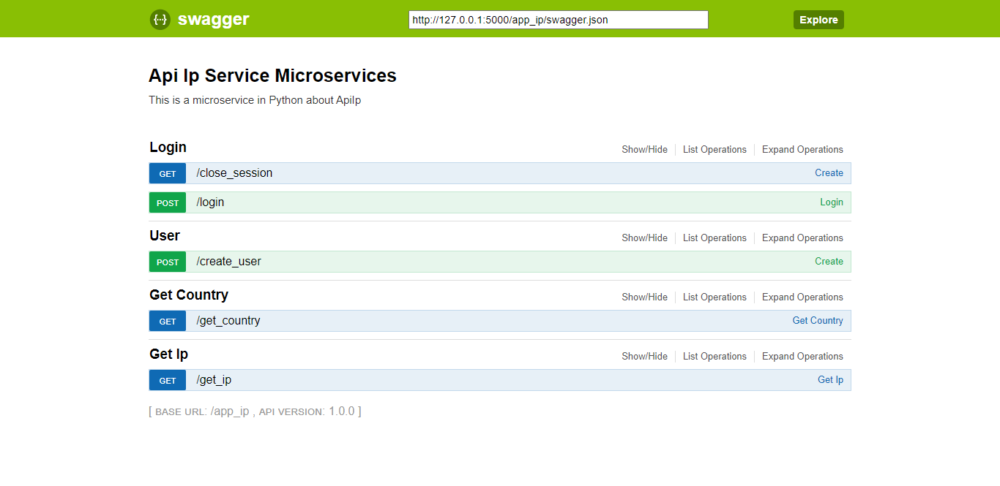
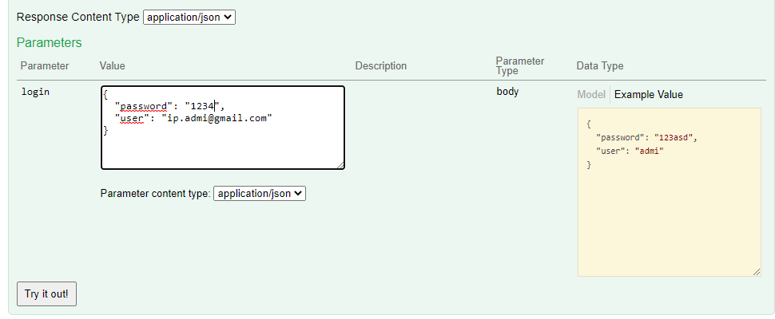
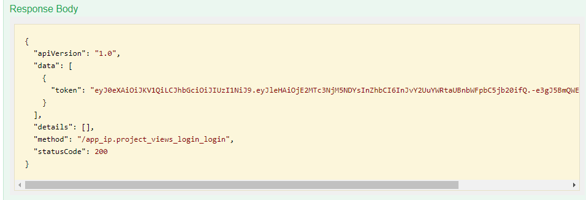
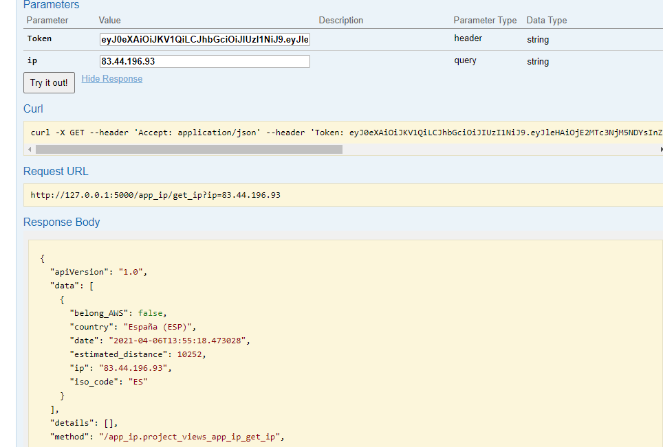

# Correr Aplicación
Para realiza la ejecución del programa se debe ingresar a la carpeta SecurityComputing.

Ejecutar la ejecución del Docker Compose 
```bash
docker-compose up -d
```

## Ingresar a Swagger
Para ingresar ejecutar los metodos se puede ingresar al swagger con la siguiente url:
 * swagger-ui: `http://localhost:5040/app_ip/swagger/`
 * swagger-ui looks like this:
    

## Uso del servicio
Para el correcto uso del servicio se debe logear primero el usuario:
  1. Ejecutar el metodo /login con las credenciales:  `user: ip.admi@gmail.com, password: 1234`
     
  2. Al momento de ejecutar este servicio nos devuelve un token de seguridad el cúal vamos a enviar a los demas metodos
    para que funcione correctamente
    
  3. Ejemplo de uso del token en metodo de ip
    
* El parametro del usuario se esta obteniendo del token previamente creado.
